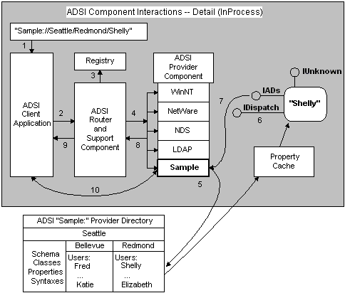

# Binding to an Active Directory Object

The most common way to bind to an Active Directory object is to use the **GetObject** function between an ADSI client and an ADSI provider. This is also the easiest way to show how the provider component receives and services requests. Both the ADSI API function [**ADsGetObject**](/windows/desktop/api/Adshlp/nf-adshlp-adsgetobject) or the Visual Basic function **GetObject** follow the same steps for binding.

For this example, assume the ADSI client is an ADSI viewer application that has received the ADsPath "Sample://Seattle/Redmond/Shelly" from its user interface (1). The following figure details the sequence of events by numbering the flow arrows.

In the preceding figure, the client initiates the request for an interface pointer on the Active Directory object represented by the ADsPath "Sample://Seattle/Redmond/Shelly" from ADSI services (2). During initialization, the services software populated a table of installed provider programmatic identifiers (ProgIDs) from the registry ("LDAP:","Sample:", "WinNT:", and so on) and paired them with the matching **CLSID**s which identify the appropriate software module.

The ADSI server verifies that the ProgID, in this case "Sample:", exists in the ADsPath. It then creates a bind context to optimize further references to this object, and calls the standard COM function [**MkParseDisplayName**](/windows/win32/api/objbase/nf-objbase-mkparsedisplayname) to create a COM moniker that can be used to find and bind to the object that represents the user "Shelly".

In the following section, the file names of the example provider component source code are included in parentheses where appropriate.

As in other COM server implementations, [**MkParseDisplayName**](/windows/win32/api/objbase/nf-objbase-mkparsedisplayname) examines the ProgID, and looks up the proper **CLSID** in the registry (3) to find the corresponding provider-supplied class factory code (Cprovcf.cpp) in the appropriate provider implementation (4). This code creates an initial top-level object that implements the [**IParseDisplayName::ParseDisplayName**](/windows/win32/api/oleidl/nf-oleidl-iparsedisplayname-parsedisplayname) method (Cprov.cpp). The provider's implementation of **ParseDisplayName** resolves the path in the provider's own namespace. This eventually calls ADsObject and invokes the parser supplied with the provider component (Parse.cpp) to verify that the ADsPath is syntactically correct for this namespace.

**GetObject**, that is defined in Getobj.cpp, then determines if the object requested is a namespace object, a schema object, or some other type of object. If either of the first two, that type of schema class object is created and the appropriate interface pointer retrieved. Otherwise the Sample directory path is created from the ADsPath (for example, "\\Seattle\\Redmond\\Shelly", but in a different directory service it might have had to be "\\OU=Seattle\\OU=Redmond\\CN=Shelly") and control passes to SampleDSOpenObject which opens the object in the example data storage and also retrieves its object type (in this case, "User") (5).

With the data gathered, a new object is created (6) to represent the item described by the ADsPath, and a pointer to the [**IUnknown**](/windows/win32/api/unknwn/nn-unknwn-iunknown) interface on that object is retrieved. In this case, a generic Active Directory object is created that supports the **IUnknown** and [**IADs**](/windows/desktop/api/Iads/nn-iads-iads) methods (Cgenobj.cpp, Core.cpp). The CSampleDSGenObject::AllocateGenObject routine reads the type library data to create the proper dispatch entries for these new objects in order to support [**IDispatch**](/windows/win32/api/oaidl/nn-oaidl-idispatch).

Wrapping this interface pointer into a moniker completes the ResolvePathName (Cprov.cpp) function and parses the display name.

All the COM objects created during this process are cached for performance reasons and managed through the binding context. This improves performance for other operations on the same object that immediately follows the moniker binding.

This well-formed Active Directory object is now queried for the interface identifier requested for the initial [**ADsGetObject**](/windows/desktop/api/Adshlp/nf-adshlp-adsgetobject) call and a pointer to that interface is retrieved (7) and passed back through the ADSI server to the client (8&9). From then on, the client works directly with the provider component through the interface methods until the initial request is satisfied (10).

Furthermore, requests for object data from the client usually take the form of requests for property gets and puts, all of which are optimized through the provider implementation of a property cache (Cprops.cpp). Intelligently packing and unpacking data, often including copying and freeing structures and strings, between the native data types on the example provider component's operating system and the Automation [**VARIANT**](/windows/win32/api/oaidl/ns-oaidl-variant) type supported by ADSI takes place before the properties are loaded into the cache (Smpoper.cpp).

The example provider component is designed so that the actual calls to the operating system are logically isolated from the provider component, creating software portable to more than one operating system (RegDSAPI.cpp).

 

 
