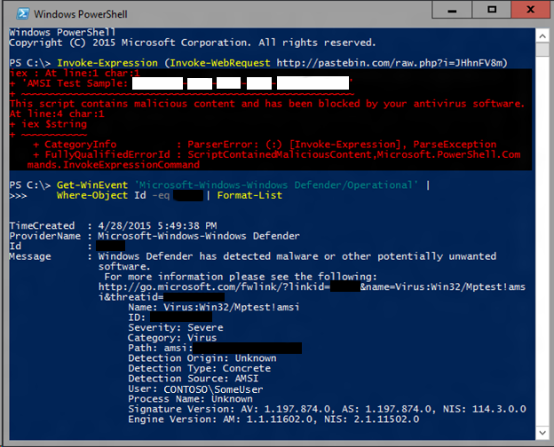
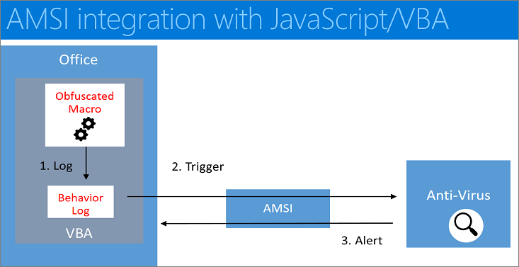

# How the Antimalware Scan Interface (AMSI) helps you defend against malware

For an introduction to the Windows Antimalware Scan Interface (AMSI), see [Antimalware Scan Interface (AMSI)](antimalware-scan-interface-portal.md).

As an application developer, you can actively participate in malware defense. Specifically, you can help protect your customers from dynamic script-based malware, and from non-traditional avenues of cyber attack.

By way of an example, let's say that your application is scriptable: it accepts arbitrary script, and executes it via a scripting engine. At the point when a script is ready to be supplied to the scripting engine, your application can call the Windows AMSI APIs to request a scan of the content. That way, you can safely determine whether or not the script is malicious before you decide to go ahead and execute it.

This is true even if the script was generated at runtime. Script (malicious or otherwise), might go through several passes of de-obfuscation. But you ultimately need to supply the scripting engine with plain, un-obfuscated code. And that's the point at which you invoke the AMSI APIs.

Here's an illustration of the AMSI architecture, where your own application is represented by one of the "Other Application" boxes.

The Windows AMSI interface is open. Which means that any application can call it; and any registered anti-malware engine can process the content submitted to it.

We needn't limit the discussion to scripting engines, either. Perhaps your application is a communication app, and it scans instant messages for viruses before it shows them to your customers. Or maybe your software is a game that validates plugins before installing them. There are plenty of opportunities and scenarios for using AMSI.

## AMSI in action

Let's take a look at AMSI in action. In this example, Windows Defender is the application that's calling AMSI APIs. But you can call the same APIs from within your own application.

Here's a sample of a script that uses the XOR-encoding technique to hide its intent (whether that intent is benign or not). For this illustration, we can imagine that this script was downloaded from the Internet.

To make things more interesting, we can enter this script manually at the command line so that there is no actual file to monitor. This mirrors what's known as a "fileless threat". It's not as simple as scanning files on disk. The threat might be a backdoor that lives only in the memory of a machine.

Below, we see the result of running the script in Windows PowerShell. You'll see that Windows Defender is able to detect the AMSI test sample in this complicated scenario, merely by using the standard AMSI test sample signature.

## AMSI integration with JavaScript/VBA

The illustrated workflow below describes the end-to-end flow of another example, in which we demonstrate AMSI's integration with macro execution within Microsoft Office.

- The user receives a document containing a (malicious) macro, which evades static antivirus software scans by employing techniques such as obfuscation, password-protected files, or other.
- The user then opens the document containing the (malicious) macro. If the document opens in Protected View, then the user clicks **Enable Editing** to exit Protected View.
- The user clicks **Enable Macros** to allow macros to run.
- As the macro runs, the VBA runtime uses a circular buffer to log \[1\] data and parameters related to calls to Win32, COM, and VBA APIs.
- When specific Win32 or COM APIs that are considered high risk (also known as *triggers*) \[2\] are observed, macro execution is halted, and the contents of the circular buffer are passed to AMSI.
- The registered AMSI anti-malware service provider responds with a verdict to indicate whether or not the macro behavior is malicious.
- If the behavior is non-malicious, then macro execution proceeds.
- Otherwise, if the behavior is malicious, then Microsoft Office closes the session in response to the alert \[3\], and the AV can quarantine the file.

## What does this mean for you?

For Windows users, any malicious software that uses obfuscation and evasion techniques on Windows' built-in scripting hosts is automatically inspected at a much deeper level than ever before, providing additional levels of protection.

For you as an application developer, consider having your application call the Windows AMSI interface if you want to benefit from (and protect your customers with) extra scanning and analysis of potentially malicious content.

As an antivirus software vendor, you can consider implementing support for the AMSI interface. When you do, your engine will have much deeper insight into the data that applications (including Windows' built-in scripting hosts) consider to be potentially malicious.

## More background info about fileless threats

You may be curious for more background info about the kinds of fileless threats that Windows AMSI is designed to help you defend against. In this section, we'll take a look at the traditional cat-and-mouse game that plays out in the malware ecosystem.

We'll use PowerShell as an example. But you can leverage the same techniques and processes we'll demonstrate with any dynamic language&mdash;VBScript, Perl, Python, Ruby, and more.

Here's an example of a malicious PowerShell script.

While this script simply writes a message to the screen, malware is typically more nefarious. But you could easily write a signature to detect this one. For example, the signature could search for the string "Write-Host 'pwnd!'" in any file that the user opens. Great: we've detected our first malware!

After being detected by our first signature, though, malware authors will respond. They respond by creating dynamic scripts such as this example.

In that scenario, malware authors create a string representing the PowerShell script to run. But they use a simple string concatenation technique to break our earlier signature. If you ever view the source of an ad-laden web page, you'll see many instances of this technique being used to avoid ad-blocking software.

Finally, the malware author passes this concatenated string to the `Invoke-Expression` cmdlet&mdash;PowerShell's mechanism to evaluate scripts that are composed or created at runtime.

In response, anti-malware software starts to do basic language emulation. For example, if we see two strings being concatenated, then we emulate the concatenation of those two strings, and then run our signatures on the result. Unfortunately, this is a fairly fragile approach, because languages tend to have a lot of ways to represent and concatenate strings.

So, after being caught by this signature, malware authors will move to something more complicated&mdash;for example, encoding script content in Base64, as in this next example.

Being resourceful, most antimalware engines implement Base64 decoding emulation, as well. So, since we also implement Base64 decoding emulation, we're ahead for a time.

In response, malware authors move to algorithmic obfuscation&mdash;such as a simple XOR-encoding mechanism in the scripts they run.

At this point, we're generally past what antivirus engines will emulate or detect, so we won't necessarily detect what this script is doing. However, we can start to write signatures against the obfuscation and encoding techniques. In fact, that's what accounts for the vast majority of signatures for script-based malware.

But what if the obfuscator is so trivial that it looks like many well-behaved scripts? A signature for it would generate an unacceptable number of false positives. Here's a sample *stager* script that's too benign to detect on its own.

In that example, we're downloading a web page, and invoking some content from it. Here's the equivalent in Visual Basic script.

What makes things worse in both of these examples is that the antivirus engine inspects files being opened by the user. If the malicious content lives only in memory, then the attack can potentially go undetected.

This section showed the limitations of detection using traditional signatures. But, while a malicious script might go through several passes of de-obfuscation, it ultimately needs to supply the scripting engine with plain, un-obfuscated code. And at that point&mdash;as we described in the first section above&mdash;Windows' built-in scripting hosts call the AMSI APIs to request a scan of this unprotected content. And your application can do the same thing.

## Related resources

- [Fileless threats](/microsoft-365/security/defender-endpoint/malware/fileless-threats)
- [Office VBA + AMSI: Parting the veil on malicious macros](https://cloudblogs.microsoft.com/microsoftsecure/2018/09/12/office-vba-amsi-parting-the-veil-on-malicious-macros/)
- [Out of sight but not invisible: Defeating fileless malware with behavior monitoring, AMSI, and next-gen AV](https://cloudblogs.microsoft.com/microsoftsecure/2018/09/27/out-of-sight-but-not-invisible-defeating-fileless-malware-with-behavior-monitoring-amsi-and-next-gen-av/)
