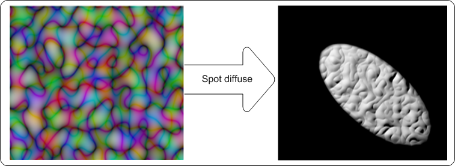
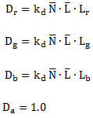

# Spot-diffuse lighting effect

Use the spot-diffuse lighting effect to create an image that appears to be a non-reflective surface with where the light source is limited to a directed cone of light and the light is scattered in all directions. This effect uses the alpha channel as a height map and lights the image with a spot light source.

The color of the output bitmap is a result of light color, light position, and the surface geometry. The alpha channel output for each pixel with diffuse lighting is always 1.0.

The CLSID for this effect is CLSID\_D2D1SpotDiffuse.

-   [Example image](#example-image)
-   [Effect properties](#effect-properties)
-   [Scale modes](#scale-modes)
-   [Requirements](#requirements)
-   [Related topics](#related-topics)

## Example image

The example here shows the input and output images of the spot-diffuse lighting effect.

The effect calculates the final output pixel values are calculated using these equations:

Where:<dl> kd = diffuse lighting constant. Specified by the user.  
 = surface normal unit vector, a function of x and y.  
 = unit vector pointing from surface to light.  
Lr, Lg, Lb = the light color in RGB components.  
</dl>

## Effect properties

| Display name and index enumeration                                                     | Type and default value                                                                      | Description                                                                                                                                                                                                                                                                                                                                                                                              |
|----------------------------------------------------------------------------------------|---------------------------------------------------------------------------------------------|----------------------------------------------------------------------------------------------------------------------------------------------------------------------------------------------------------------------------------------------------------------------------------------------------------------------------------------------------------------------------------------------------------|
| LightPosition  D2D1\_SPOTDIFFUSE\_PROP\_LIGHT\_POSITION            | D2D1\_VECTOR\_3F  {0.0f, 0.0f, 0.0f}                                    | The light position of the point light source. The property is a D2D1\_VECTOR\_3F defined as (x, y, z). The units are in device-independent pixels (DIPs) and are unbounded.                                                                                                                                                                                                                    |
| PointsAt  D2D1\_SPOTDIFFUSE\_PROP\_POINTS\_AT                      | D2D1\_VECTOR\_3F  {0.0f, 0.0f, 0.0f}                                    | Where the spot light is focused. The property is exposed as a D2D1\_VECTOR\_3F with   (x, y, z). The units are in DIPs and the values are unbounded.                                                                                                                                                                                                                                           |
| Focus  D2D1\_SPOTDIFFUSE\_PROP\_FOCUS                              | FLOAT  1.0f                                                             | The focus of the spot light. This property is unitless and is defined between 0 and 200.                                                                                                                                                                                                                                                                                                       |
| LimitingConeAngle  D2D1\_SPOTDIFFUSE\_PROP\_LIMITING\_CONE\_ANGLE  | FLOAT  90.0f                                                            | The cone angle that restricts the region where the light is projected. No light is projected outside the cone. The limiting cone angle is the angle between the spot light axis (the axis between the *LightPosition* and *PointsAt* properties) and the spot light cone. This property is defined in degrees and must be between 0 to 90 degrees.                                             |
| DiffuseConstant  D2D1\_SPOTDIFFUSE\_PROP\_DIFFUSE\_CONSTANT        | FLOAT  1.0f                                                             | The ratio of diffuse reflection to amount of incoming light. This property must be between 0 and 10,000 and is unitless.                                                                                                                                                                                                                                                                       |
| SurfaceScale  D2D1\_SPOTDIFFUSE\_PROP\_SURFACE\_SCALE              | FLOAT  1.0f                                                             | The scale factor in the Z direction. The surface scale is unitless and must be between 0 and 10,000.                                                                                                                                                                                                                                                                                           |
| Color  D2D1\_SPOTDIFFUSE\_PROP\_COLOR                              | D2D1\_VECTOR\_3F  {1.0f, 1.0f, 1.0f}                                    | The color of the incoming light. This property is exposed as a Vector 3   (R, G, B) and used to compute LR, LG, LB.                                                                                                                                                                                                                                           |
| KernelUnitLength  D2D1\_SPOTDIFFUSE\_PROP\_KERNEL\_UNIT\_LENGTH    | D2D1\_VECTOR\_2F  {1.0f, 1.0f}                                          | The size of an element in the Sobel kernel used to generate the surface normal in the X and Y direction. This property maps to the dx and dy values in the Sobel gradient. This property is a D2D1\_VECTOR\_2F(Kernel Unit Length X, Kernel Unit Length Y) and is defined in (DIPs/Kernel Unit). The effect uses bilinear interpolation to scale the bitmap to match size of kernel elements.  |
| ScaleMode  D2D1\_SPOTDIFFUSE\_PROP\_SCALE\_MODE                    | D2D1\_SPOTDIFFUSE\_SCALE\_MODE  D2D1\_SPOTDIFFUSE\_SCALE\_MODE\_LINEAR  | The interpolation mode the effect uses to scale the image to the corresponding kernel unit length. There are six scale modes that range in quality and speed. See [Scale modes](#scale-modes) for more info.                                                                                                                                                                                   |

 

## Scale modes

| Enumeration                                           | Description                                                                                                                                                                                          |
|-------------------------------------------------------|------------------------------------------------------------------------------------------------------------------------------------------------------------------------------------------------------|
| D2D1\_SPOTDIFFUSE\_SCALE\_MODE\_NEAREST\_NEIGHBOR     | Samples the nearest single point and uses that. This mode uses less processing time, but outputs the lowest quality image.                                                                           |
| D2D1\_SPOTDIFFUSE\_SCALE\_MODE\_LINEAR                | Uses a four point sample and linear interpolation. This mode outputs a higher quality image than nearest neighbor.                                                                                   |
| D2D1\_SPOTDIFFUSE\_SCALE\_MODE\_CUBIC                 | Uses a 16 sample cubic kernel for interpolation. This mode uses the most processing time, but outputs a higher quality image.                                                                        |
| D2D1\_SPOTDIFFUSE\_SCALE\_MODE\_MULTI\_SAMPLE\_LINEAR | Uses 4 linear samples within a single pixel for good edge anti-aliasing. This mode is good for scaling down by small amounts on images with few pixels.                                              |
| D2D1\_SPOTDIFFUSE\_SCALE\_MODE\_ANISOTROPIC           | Uses anisotropic filtering to sample a pattern according to the transformed shape of the bitmap.                                                                                                     |
| D2D1\_SPOTDIFFUSE\_SCALE\_MODE\_HIGH\_QUALITY\_CUBIC  | Uses a variable size high quality cubic kernel to perform a pre-downscale the image if downscaling is involved in the transform matrix. Then uses the cubic interpolation mode for the final output. |

 

> [!Note]  
> If you don't select a mode, the effect defaults to D2D1\_SPOTDIFFUSE\_SCALE\_MODE\_LINEAR.

 

## Requirements

| Requirement | Value |
|--------------------------|------------------------------------------------------------------------------------|
| Minimum supported client | Windows 8 and Platform Update for Windows 7 \[desktop apps \| Windows Store apps\] |
| Minimum supported server | Windows 8 and Platform Update for Windows 7 \[desktop apps \| Windows Store apps\] |
| Header                   | d2d1effects.h                                                                      |
| Library                  | d2d1.lib, dxguid.lib                                                               |

 

## Related topics

<dl> <dt>

[**ID2D1Effect**](/windows/win32/api/d2d1_1/nn-d2d1_1-id2d1effect)
</dt> </dl>

 

