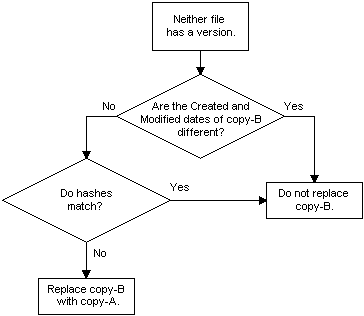

# Neither File Has a Version with File Hash Check

File hashing is available with Windows Installer. For more information, see [**MsiGetFileHash**](/windows/desktop/api/Msi/nf-msi-msigetfilehasha) and the [MsiFileHash table](msifilehash-table.md). The MsiFileHash table can only be used with unversioned files.

If the key file of a component being installed (copy-A) has the same name as a file already installed in the target location (copy-B), the installer compares the version number, date, and language of the two files.

If neither file has a version number, the installer uses the logic illustrated by the following flow diagram to determine whether to replace all of the installed files belonging to the component. Because the installer only installs entire components, if the installed key file is replaced then, all of the component's files are replaced.

Note that this diagram illustrates the default [File Versioning Rules](file-versioning-rules.md), which can be overridden by setting the [**REINSTALLMODE**](reinstallmode.md) property. The default value of the **REINSTALLMODE** property is "omus".

See the examples of default file versioning in [Replacing Existing Files](replacing-existing-files.md).

-   [Both Files Have a Version](both-files-have-a-version.md)
-   [Neither File Has a Version](neither-file-has-a-version.md)
-   [One File Has a Version](one-file-has-a-version.md)

 

 

