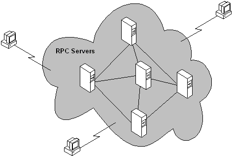

# The Model for Distributed Systems

Traditionally, having a monolithic system run across multiple computers meant splitting the system into separate client and server components. In such systems, the client component handled the user interface and the server provided back-end processing, such as database access, printing, and so on. As computers proliferated, dropped in cost, and became connected by ever-higher bandwidth networks, splitting software systems into multiple components became more convenient, with each component running on a different computer and performing a specialized function. This approach simplified development, management, administration, and often improved performance and robustness, since failure in one computer did not necessarily disable the entire system.

In many cases the system appears to the client as an opaque cloud that performs the necessary operations, even though the distributed system is composed of individual nodes, as illustrated in the following figure.

The opacity of the cloud is maintained because computing operations are invoked on behalf of the client. As such, clients can locate a computer (a *node*) within the cloud and request a given operation; in performing the operation, that computer can invoke functionality on other computers within the cloud without exposing the additional steps, or the computer on which they were carried out, to the client.

With this paradigm, the mechanics of a distributed, cloud-like system can be broken down into many individual packet exchanges, or conversations between individual nodes.

Traditional client-server systems have two nodes with fixed roles and responsibilities. Modern-distributed systems can have more than two nodes, and their roles are often dynamic. In one conversation a node can be a client, while in another conversation the node can be the server. In many cases, the ultimate consumer of the exposed functionality is a client with a user sitting at a keyboard, watching the output. In other cases the distributed system functions unattended, performing background operations.

The distributed system may not have dedicated clients and servers for each particular packet exchange, but it is important to remember there is a caller, (or initiator, either of which is often referred to as the client). There is also the recipient of the call (often referred to as the server). It is not necessary to have two-way packet exchanges in the request-reply format of a distributed system; often messages are sent only one way.

 

 

