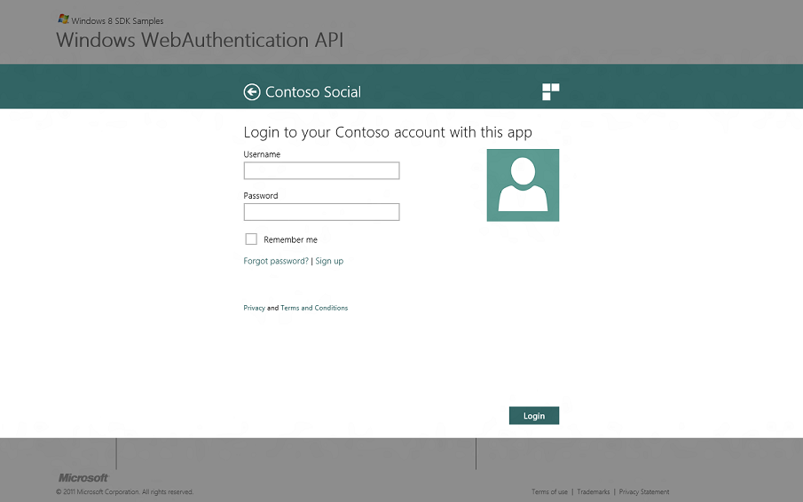
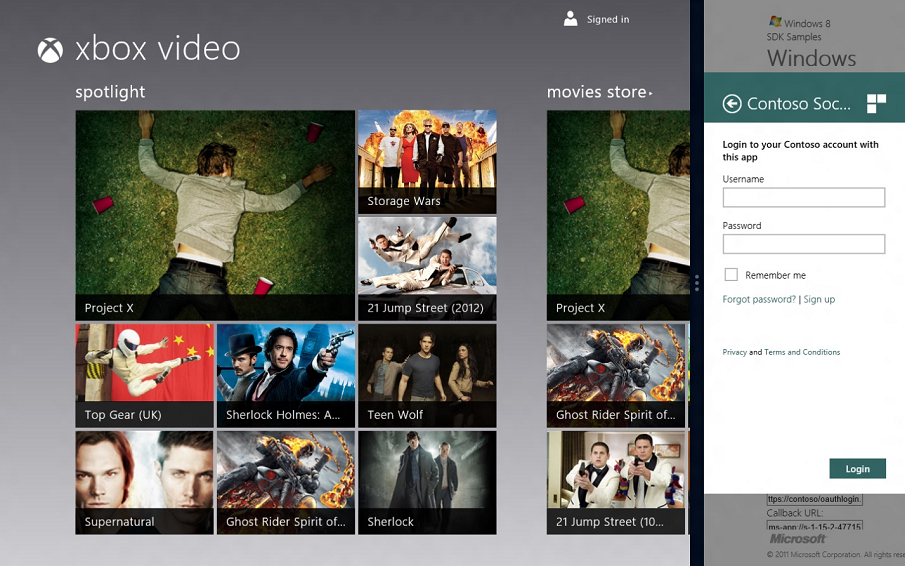
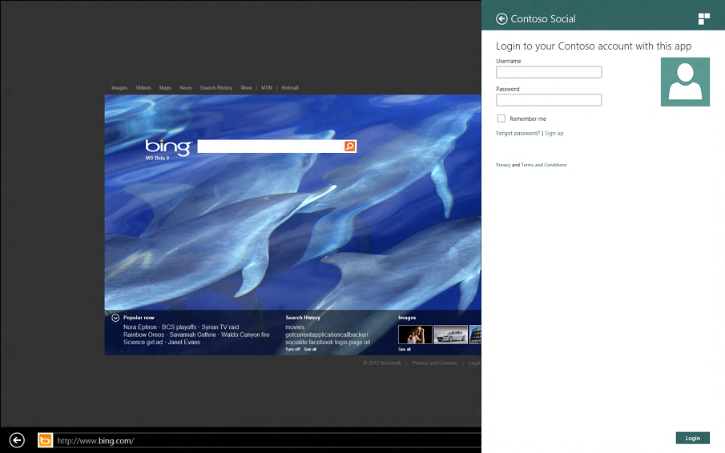
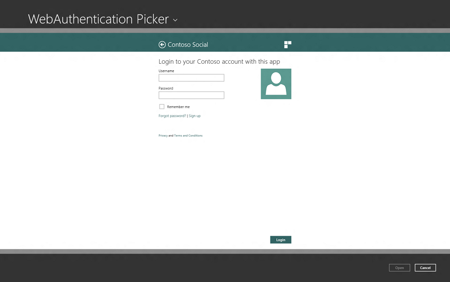

# Considerations for the web page development

Web Authentication Broker is built on the top of the same technologies that power Internet Explorer in Windows. However, due to a very special purpose of this component some features of the Internet Explorer were disabled or locked to specific configuration. Also, Web Authentication Broker provides a dedicated event logging channel to help troubleshoot issues with pages that it processes.

## Internet Explorer 10 standard document mode

The Web Authentication Broker displays all pages in the "IE10 Standards Mode". You can use the developer tools in Internet Explorer to see how your page works under different document modes. For more information on Internet Explorer 10 compatibility, see [Internet Explorer](/previous-versions/windows/internet-explorer/ie-developer/dev-guides/hh673527(v=vs.85)).

## Disabled and locked down features

Several features of Internet Explorer are either completely disabled or locked down to specific values that can't be changed in the Internet Options of the operating system.

| Feature                            | Status                                                                                                                                                                                                          |
|------------------------------------|-----------------------------------------------------------------------------------------------------------------------------------------------------------------------------------------------------------------|
| Application Cache API ("AppCache") | Disabled                                                                                                                                                                                                        |
| Link history                       | Disabled                                                                                                                                                                                                        |
| Temporary files                    | Enabled                                                                                                                                                                                                         |
| Cookies                            | Session cookies are enabled. Persisted cookies are allowed, but are subject to automatic cleanup unless the Web Authentication Broker is in the SSO mode. For more information, see the Single Sign On section. |
| Index DB                           | Disabled                                                                                                                                                                                                        |
| DOM storage                        | Disabled                                                                                                                                                                                                        |
| ActiveX                            | Disabled                                                                                                                                                                                                        |
| File downloads                     | Disabled                                                                                                                                                                                                        |

 

## HTTPS requirement

The first URL that an application will use to communicate with the online provider is required to be HTTPS.

## Dimension for different window sizes

A Windows 8 app may appear in several different sizes such as full screen, a resized window, or within a Charm such as Share Charm. Depending in which window layout the Web Authentication Broker appears, the size with which the web pages have to work could be different. For more information, see the [Guidelines for resizing to narrow layouts](/previous-versions/windows/hh465371(v=win.10)) topic and the [Guidelines for sharing content](/previous-versions/windows/hh465251(v=win.10)) topic.

The web page should use CSS media queries to check the size it has to work with and lay itself out accordingly. However, the page should not be designed based on the exact pixels documented here and should be able to scale to different sizes. The sizes specified in this document are subject to change in future OS versions.

If a page can't fit all of the information in the allotted space (for example, a long list of permissions that an application is requesting), the Web Authentication Broker will provide scroll bars to allow the user to scroll the page as needed. Zooming is also provided by pinch zoom for touch-based devices and Ctrl + mouse wheel for desktop and laptop PCs.

To test different scaling factors use the [Web Authentication Broker SDK sample app](https://github.com/microsoft/Windows-universal-samples/tree/master/Samples/WebAuthenticationBroker) loaded in Microsoft Visual Studio Professional 2012 which allows simulating the full screen and resized states.

In addition to different layouts documented above, make sure to test your page in different screen orientation (for example, portrait and landscape), and different locales and languages as well as with accessibility features such as the "Make everything bigger" option turned on.

The available layouts are:

-   [Full screen](#full-screen)
-   [Resized window](#resized)
-   [Charm view](#charm-view)
-   [File picker view](#file-picker-view)

### Full screen

For the full screen layout, the web page dimensions are:

-   Width: 566 pixels
-   Height: Screen height (depends on the screen resolution)

The following example shows the web authentication broker UI in full screen layout.

### Resized

For a resized window, the web page dimensions can be:

-   Width: 260 pixels
-   Height: Screen height (depends on the screen resolution)

The following example shows the Web Authentication Broker UI in a resized window on the XBox web page. Note that the Web Authentication Broker UI is only on the right side of the screen capture.

### Charm view

For the Charm view, the web page dimensions are:

-   Width: 566 pixels
-   Height: Screen height (depends on the screen resolution)

The following example shows the Web Authentication Broker UI in Charm view.

### File picker view

For the file picker view, the web page dimensions are:

-   Width: 566 pixels
-   Height: Screen height (depends on the screen resolution)

The following example shows the Web Authentication Broker UI in file picker view.

## No new windows by default

By default, no URLs will result in a new window being opened but will instead be displayed within the Web Authentication Broker window. This includes window.open JavaScript method, "target" attribute of the hyperlinks, or when the user uses the Ctrl+Click mechanism to force a new window to open. The exception to this rule is when a web page declares a link as safe to be navigated in a browser as described in the Customizing Target of the Hyperlinks.

## Related topics

<dl> <dt>

[Web Authentication Broker SDK sample app](https://github.com/microsoft/Windows-universal-samples/tree/master/Samples/WebAuthenticationBroker)
</dt> <dt>

[**Windows.Security.Authentication.Web**](/uwp/api/Windows.Security.Authentication.Web)
</dt> </dl>

 

 
