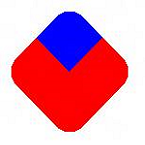

# Clipping (DirectComposition)

> [!NOTE]
> For apps on Windows 10, we recommend using Windows.UI.Composition APIs instead of DirectComposition. For more info, see [Modernize your desktop app using the Visual layer](/windows/uwp/composition/visual-layer-in-desktop-apps).

Clipping provides a way to reveal only a portion of a visual or visual tree by limiting the rendering of the visual or tree to a particular rectangular area. This topic describes Microsoft DirectComposition support for clipping visuals. It includes the following sections:

-   [Clip rectangle](#clip-rectangle)
-   [Clip object](#clip-object)
-   [Animated clip rectangle](#animated-clip-rectangle)
-   [Related topics](#related-topics)

## Clip rectangle

A visual object has a Clip property that defines a rectangular region, or *clip rectangle*, within the visual's bitmap content. When the visual is rendered to the screen, only the portion of the bitmap content that is inside the clip rectangle is drawn on the screen, while the content that extends outside the clip rectangle is clipped (not drawn). By default, the Clip property includes all bitmap content.

A visual's Clip property applies to all child and descendent visuals. In other words, any child or descendent content that falls outside the bounds of the parent's clip rectangle is also clipped.

DirectComposition applies the Clip property before applying the OffsetX, OffsetY, and 2D Transform properties, but after applying the Effect and 3D Transform properties. This means that 2D Transforms, OffsetX, and OffsetY, will affect both the visual content, and the clip rectangle. Whereas 3D transforms and effects will not apply to the clip rectangle.

For example, when applying an offset or 2D transform, the clip rectangle is affected by the transformation matrix. So adding an offset and a 2D rotate (45 degrees) along with a rounded corner clip rectangle will result in this:

When applying a 3D transformation “within” the clip rectangle, the clip rectangle is not affected by the transformation matrix. Even when applying a rotation around the Z axis (effectively the same as the previous example), the following diagram is the result:

Note that the visual rotated within the clip because the 3D matrix is not applied to the clip itself.

If the Clip property is set to an empty rectangle, the visual is fully clipped; that is, the visual is included in the visual tree, but it does not render anything. If you do not want to include a particular visual in a composition, remove the visual from the visual tree instead of setting an empty clip rectangle. Removing the visual results in better performance.

You set the Clip property of a visual by using the [**IDCompositionVisual::SetClip**](/windows/win32/api/dcomp/nf-dcomp-idcompositionvisual-setclip(constd2d_rect_f_)) method. This method includes overloads that enable you to set the value of the Clip property to a static rectangle or to a clip object. Use a static rectangle if you do not need to change the dimensions of the clip rectangle during the lifetime of the visual. If you do need to change the dimensions or animate the clip rectangle, use a clip object.

## Clip object

A clip object is a Component Object Model (COM) object that represents a clip rectangle. You create a clip object by using the [**IDCompositionDevice::CreateRectangleClip**](/windows/win32/api/dcomp/nf-dcomp-idcompositiondevice-createrectangleclip) method, and then use the object's [**IDCompositionRectangleClip**](/windows/win32/api/dcomp/nn-dcomp-idcompositionrectangleclip) interface to set the properties of the object. A newly created clip object has the minimum possible values for the Left and Top properties, and the maximum possible values for the Right and Bottom properties, effectively making it a no-op clip object. In other words, the object represents a clip rectangle that would include the entire bitmap content of a visual.

A clip object includes a set of properties that enable you to specify rounded corners for the clip object. The properties enable you to set the x radius and y radius of each corner of the clipping object.

## Animated clip rectangle

You can animate a clip rectangle by applying animation objects to the Left, Top, Right, and Bottom properties of a clip object. Use the [**IDCompositionVisual::SetClip(IDCompositionClip)**](/windows/win32/api/dcomp/nf-dcomp-idcompositionvisual-setclip(idcompositionclip)) overloaded method to apply the animated clip rectangle to the Clip property of a visual.

For more information about animation objects, see [Animation](animation.md).

## Related topics

<dl> <dt>

[DirectComposition Concepts](directcomposition-concepts.md)
</dt> <dt>

[How to Clip with a Rectangle Clip Object](how-to--set-the-clip-rectangle-for-a-visual.md)
</dt> </dl>

 

 
