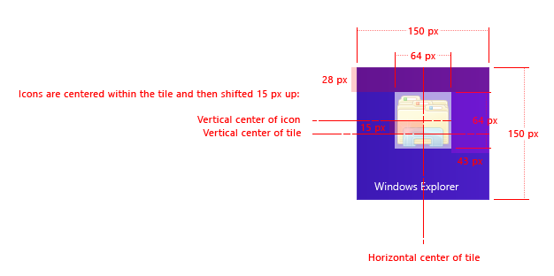

# Desktop App Tiles on the Start Screen

The following provides information on choices to consider when tailoring desktop app tiles for Windows 8 including how to design desktop app tiles for the new Start screen and how to choose what entry points to show in the Start screen.

## Design your tile for the Start screen

You can customize two aspects of your desktop app tiles: the app name, and icon. The background color is derived from the user's chosen background color and isn't programmatically customizable.

DO: Avoid truncation of your application name. Desktop tiles pinned to the Start screen can accommodate up to two lines of text each line, or about around ten characters (though this depends on the UI language), so try to keep the application name short enough to avoid truncation.

DO: Provide icons for the four supported Start screen scale values to ensure that your icons look crisp on all form factors.

| Scale | Tile size (in pixels) | Icon size used (in pixels) |
|-------|-----------------------|----------------------------|
| 80%   | 120 x 120             | 48 x 48                    |
| 100%  | 150 x 150             | 64 x 64                    |
| 140%  | 210 x 210             | 96 x 96                    |
| 180%  | 270 x 270             | 128 x 128                  |

 

DO: Embrace the Microsoft design principles. The new look and feel for icons is flat, so if you want to mimic Windows Store app icons for your desktop app, consider taking out drop shadows and so on.

DON'T: Don't avoid the use of color. While Windows Store app icons are sometimes monochromatic, we recommend using color icons for desktop apps. This helps differentiate desktop applications on the taskbar, and from other desktop app tiles in the Start screen because the background color of desktop tiles can't be customized. Do consider using more saturated colors.

## Decide the right entry points to include in the Start screen

DO: Add one shortcut per app in the Start screen when the app is installed. This ensures that people can launch your app directly from the Start screen or through search. If you do not include a shortcut in the Start screen, your app becomes difficult to launch. In particular, do not add a shortcut only on the desktop. Users see the Start screen when they first login, and so placing a shortcut only on the desktop isn't as effective as including it in the Start screen.

DON'T: Don't provide multiple shortcuts to the same app. For example, don't have two shortcuts that launch an app in two different modes, such as one for Windows Internet Explorer and one for Internet Explorer with no add-ons.

DO: Minimize the number of tiles that are added as part of installation. Consider exposing other entry points to the extraneous apps. For example, instead of including a separate Settings app with a console app, access the settings through a feature in the console app.

DON'T: Don't put shortcuts to the following items on the Start screen:

-   Uninstallers. Users can access uninstallers through the Programs item in the Control Panel.
-   Help files. Include help topics directly in your app.
-   App settings and options. Include UI to configure settings for an app within the app or create a Control Panel item.
-   Web sites. Provide any appropriate links to information like help and technical support sites directly in your app.
-   Wizards. Wizards and other one-time configuration tasks should be launched from within the app.

DON'T: Don't create shortcuts to features or functionality that can be launched from within the app itself. For example, Language Settings can be configured from any Microsoft Office app, so it's unnecessary also to have a separate Language Settings entry point on the Start screen.

DON'T: Don't create shortcuts to items that are not executable files. Shortcuts that don't map to executables, such as shortcuts that launch web sites or help files, are filtered out of the Start screen.

DO: If you install a suite of apps rather than a single app, add one shortcut for each app in the suite. As mentioned above, avoid creating shortcuts to secondary functionality like help information, utilities, and settings. That functionality should be included in the relevant app(s) of the suite.

DO: Create a single-level product folder for suites that contain three or more tiles. In the Apps view of the Start screen, accessible from the Search charm, applications are grouped by their top level folder. Choose a descriptive yet concise folder name; three words or fewer are recommended. Be aware that while the Apps view groups tiles and shows the folder name, this name isn't visible when a tile is pinned to the Start screen, so make your tile names sufficiently descriptive.

DON'T: Don't create a product folder if your suite contains only a single shortcut. Place your shortcut in the top-level Start folder.

DO: When installing a suite of more than three apps, consider whether any of those apps are for secondary, more irregular use and should not be pinned to the Start screen. If so, perhaps those tiles can be removed entirely, according to the guidance above, and launched from within a primary app. If you can't remove the tiles, consider unpinning them from the Start screen. That way, the shortcuts still appear in the **All Apps** view but don't clutter the user's Start screen.

To create add an app shortcut without pinning it to the Start screen, set the following property on the shortcut: System.AppUserModel.StartPinOption = 1. The symbolic name for 1 is APPUSERMODEL\_STARTPINOPTION\_NOPINONINSTALL.

This prevents the shortcut from being shown on the Start screen, but it can still be seen in the **All Apps** view and search results. Only the user can unpin existing shortcuts, so you must set this property during installation or immediately after placing the app on disk.

DON'T: Don't create a tile for a host or runtime for applications, like Silverlight or Java. Provide an entry point to uninstall the framework in Add/Remove Programs and provide any settings entry point in Control Panel.

 

 

