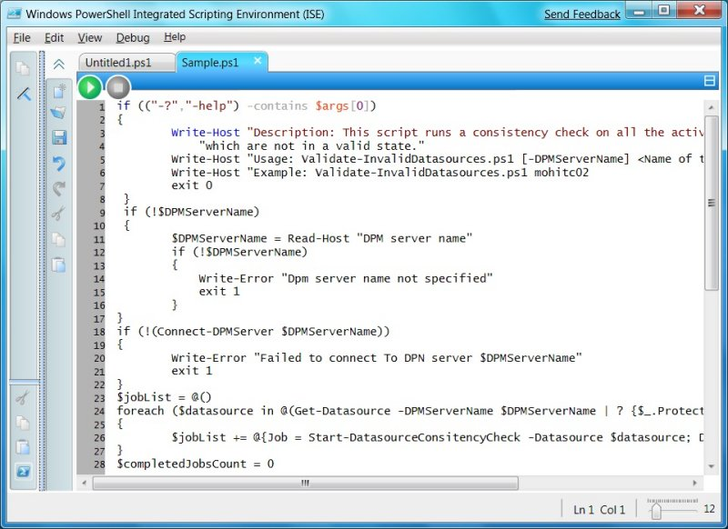

# Management and Deployment

IT professionals or developers preparing to deploy Windows 7 will have increased confidence and experience a shorter evaluation cycle because of improvements in imaging features and tools. These include support for managing applications, drivers, and operating systems in offline image files. Additionally, image creation and management will be easier and will be available to a broader range of IT organizations. Deploying Windows 7 to business computers will also be easier and faster because of new IT migration tools and automated deployment technologies.

## Windows PowerShell 2.0

PowerShell is a complete Microsoft .NET managed scripting language that has both an interactive command line shell and a graphical Integrated Scripting Environment (ISE). It supports branching, looping, functions, debugging, exception handling, and internationalization. PowerShell 2.0 is part of Windows 7 and delivers many enhancements and a growing set of *cmdlets* for Windows Diagnostics, Microsoft Active Directory, Microsoft Internet Information Services (IIS) and more.

The PowerShell 2.0 remoting feature now allows users to run commands on one or more remote computers from a single computer that is running PowerShell. Developers can also host PowerShell on IIS to access and manage their servers.

PowerShell 2.0 supports partitioning and organizing PowerShell scripts by using modules that can be distributed and deployed as self-contained, reusable units. It also includes transactions support in the PowerShell engine and APIs, which means that developers can start, commit, and rollback transactions by using built-in transaction *cmdlets*. Further, the PowerShell engine includes eventing support for listening, forwarding, and acting on management and system events. PowerShell applications can be written to subscribe to certain events for synchronous or asynchronous processing. (See [Windows PowerShell](https://msdn.microsoft.com/library/bb905330.aspx).)

Figure 1. Windows PowerShell is a complete .NET managed scripting language that has both an interactive command line shell and a graphical ISE

## Windows Installer

Windows Installer has been updated to increase developer efficiency by reducing the amount of custom code that is required to create an installation package and create true per-user software installations.

Multiple Package Transaction allows developers to create a single transaction from multiple packages by using a 'chainer' to dynamically include packages in the transaction. If one or more of the packages do not install as expected, just roll back the installation.

Embedded UI Handler makes custom UIs easier to integrate by embedding a custom user interface handler in the Windows Installer package.

Embedded Multiple Package Chainer allows developers to enable installation events across multiple packages. For example, they can enable install-on-demand events, repair events, and uninstall events across multiple packages.

New features also enable the creation of true per-user installations, including support for per-user program files and "elevate now" functionality, and provide support for offline software inventory and patch applicability checks through Deployment Image Servicing and Management. (See [What's New in Windows Installer 5.0](../msi/what-s-new-in-windows-installer-5-0.md).)

 

 
