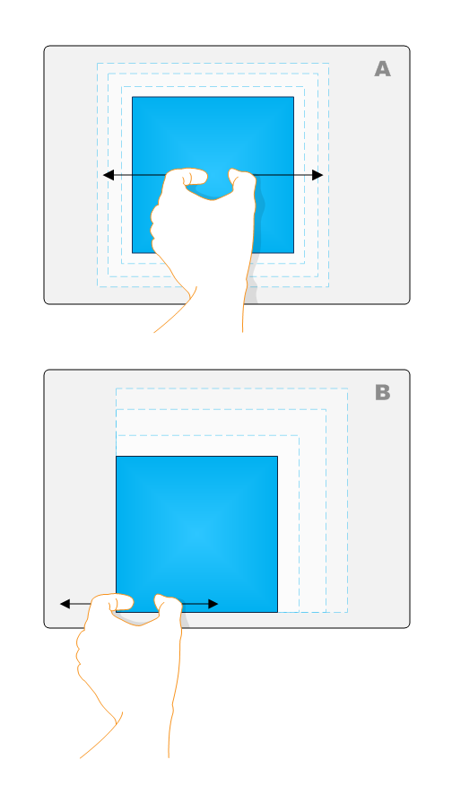

# Advanced Expansion

The following illustration shows two ways that an object can be expanded.



In example A, the simple expansion example, the object is expanded around its center point. In example B, the object is expanded around the center point of the manipulation. To enable this, you must translate the object while it is being expanded. The amount that you will translate the object is the same as the distance from the center of the object to the center point of the gesture. Intuitively, it is as though you are expanding the object from the center point of your expansion gesture and then moving it so that it is still at the same center as its initial position. The following code shows one way that this concept can be applied to enable expansion around a center point.


```C++
    if(m_fFactor != 1.0f)
    {
        // We represent our vectors as an array.
        // x: vx[0], y: vx[1]

        FLOAT v1[2];
        v1[0] = this->get_CenterX() - fOffset[0];
        v1[1] = this->get_CenterY() - fOffset[1];

        FLOAT v2[2];
        v2[0] = v1[0] * m_fFactor;
        v2[1] = v1[1] * m_fFactor;
        
        m_fdX += v2[0] - v1[0];
        m_fdY += v2[1] - v1[1];
    }
   
```


## Related topics

<dl> <dt>

[Manipulations](getting-started-with-manipulations.md)
</dt> </dl>

 

 


